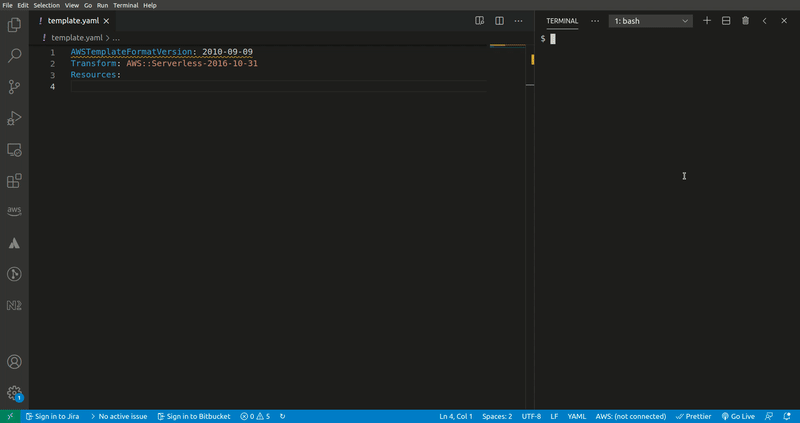
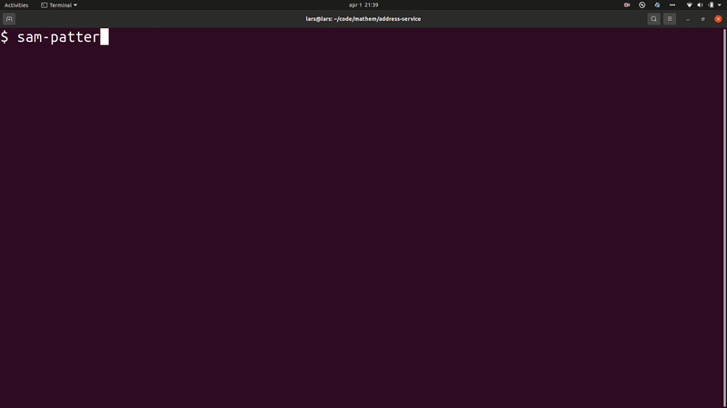

# sam-patterns-cli

*Note: this is an early version of a CLI backed by an early version of a community driven resource; https://serverlessland.com/patterns/. There might be bugs*

This tool lets you browse the content of the [Serverless Patterns Collection](https://serverlessland.com/patterns/) and inject patterns directly into your SAM template. Support for both JSON and YAML.

## Usage

### sam-patterns import
```
Usage: sam-patterns [options] [command]

Options:
  -v, --vers          output the current version
  -h, --help          display help for command

Commands:
  import|i [options]  Imports a pattern from https://github.com/aws-samples/serverless-patterns/
  help [command]      display help for command
```
## Demo


### sam-patterns explore
```
Usage: sam-patterns explore|e [options]

Explores and visualises patterns from https://github.com/aws-samples/serverless-patterns/

Options:
  -h, --help  display help for command
```


## Known issues and limitations
* Comments in YAML disappear when parsing the template
* Only content form the template.yaml file will be imported. Any supporting files like lambda functions or openapi schemas will not be imported.
* Only works with SAM templates
