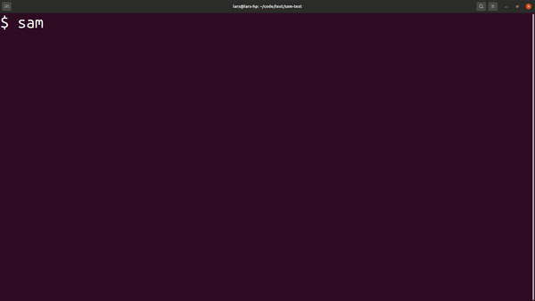
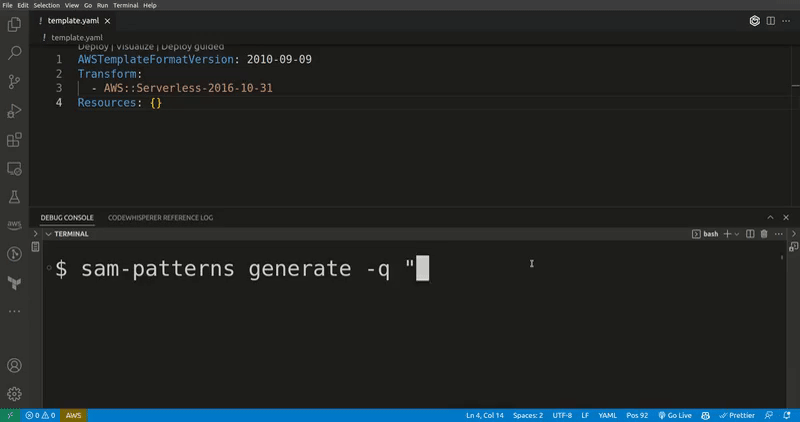
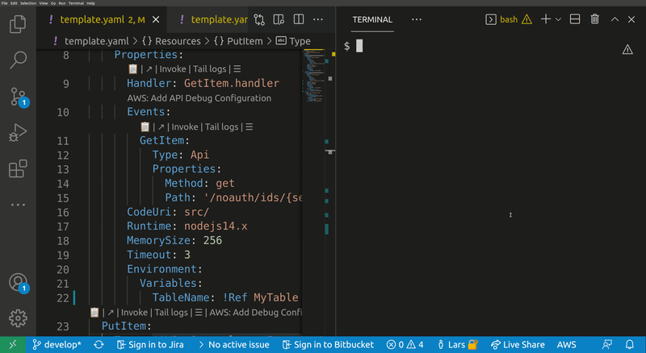
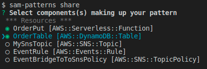
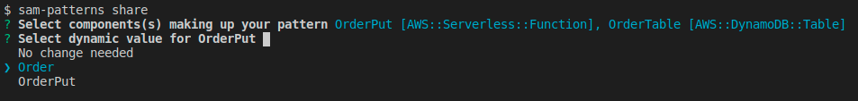
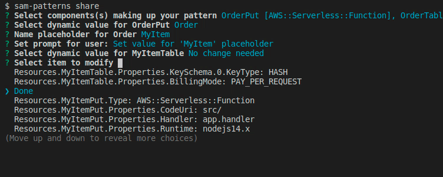
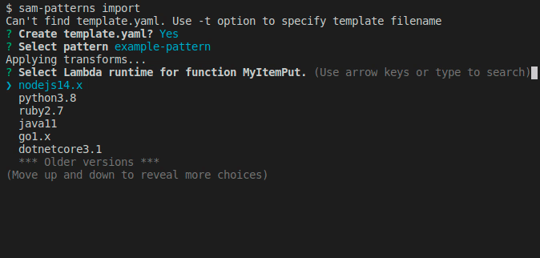
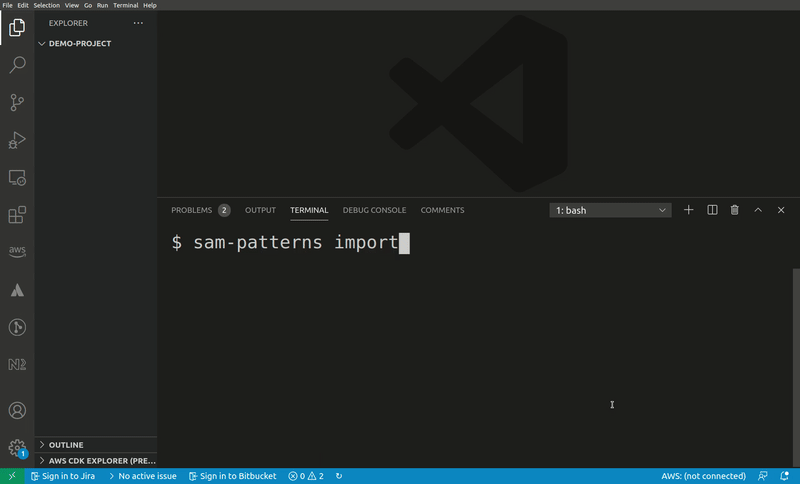

# sam-patterns-cli

*Note: this is an early version of a CLI backed by an early version of a community driven resource; https://serverlessland.com/patterns/. There might be bugs*

This tool lets you browse the content of the [Serverless Patterns Collection](https://serverlessland.com/patterns/) and [Serverless Workflow Collection](https://serverlessland.com/workflows/) and inject patterns directly into your SAM template. Support for both JSON and YAML.

## Installation
`npm install -g sam-patterns-cli`

Acquire a Github access token from [here](https://github.com/settings/tokens) and either store it in environment variable `GITHUB_TOKEN` or configure the tool using `sam-patterns configure --github-token <token>` (recommended). This is not strictly required, but if you don't you'll be rate limited to 60 requests per hour. Note that SSH auth is not supported by by the OctoKit SDK.

## Usage

### sam-patterns init
Initialises a SAM project based on a cookiecutter template. By default the tool gives access to the same [AWS managed templates](https://github.com/aws/aws-sam-cli-app-templates) that are used by [sam-cli](https://github.com/aws/aws-sam-cli).

You can add custom template locations by using the `--add-repository` flag.

```
Usage: sam-patterns init [options]

Initialises a SAM project from a quick-start template. See https://github.com/aws/aws-sam-cli-app-templates for examples and structure.

Options:
  -r, --add-repository  GitHub repository where your templates are located (default: false)
  -h, --help            display help for command
```


### sam-patterns import
Imports a serverless pattern into an existing template. You can merge one or more resources in the imported pattern with existing resources in your template by adding the `--merge` flag to, for example, combine `sqs-lambda` and `lambda-dynamodb` as one `sqs-lambda-dynamodb` pattern. 

```
Usage: sam-patterns import|i [options]

Imports a pattern from https://github.com/aws-samples/serverless-patterns/

Options:
  -t, --template [template]            SAM template file (default: "template.yaml")
  -m, --merge                          Merge pattern with existing template resource(s) (default: false)
  -a, --asl-format [asl-format]        Output format for StepFunctions ASL definitions (YAML or JSON) (default: "YAML")
  -f, --source-filter [source-filter]  Filter text to match against source collection names. Optional (default: "")
  -h, --help                           display help for command
```


### sam-patterns explore
Lets you browse and explore your serverless patterns repositories. 

```
Usage: sam-patterns explore|e [options]

Explores and visualises patterns from https://github.com/aws-samples/serverless-patterns/

Options:
  -h, --help  display help for command
```


### sam-patterns generate
Generates SAM resources based on a query to ChatGPT and merges them into your template. This is an experimental feature and requires a ChatGPT API key. You can get one [here](https://platform.openai.com/account/api-keys). Make sure to validate the output before deploying your template as it might contain errors or things that could incur cost 


```
Usage: sampat generate|g [options]

Generates resources from a ChatGPT response

Options:
  -t, --template [template]  SAM template file (default: "template.yaml")
  -q, --query [query]        Question to ask ChatGPT. I.e "a lambda function that's triggered by an S3 event"
  -m, --model [model]        OpenAI model to use. Valid values are 'gpt-3.5-turbo' and 'gpt-4'. Note that gpt-3.5-turbo is fine for
                             most use cases and that gpt-4 is slower and more expensive (default: "gpt-3.5-turbo")
  -h, --help                 display help for command
```



### sam-patterns source
Lets you add more sources. This could be public repositories, such as Jeremy Daly's [Serverless Reference Architectures](https://www.jeremydaly.com/serverless-reference-architectures/) or a private repository for company specific patterns.

Example how to add Jeremy Daly's reference architectures as a source:
```
? GitHub owner: serverless-architecture
? GitHub repo: reference-architectures
? Root: folder /
? Relative path to template file: /sam
? Template filename(s): template.yaml,template.yml
? URL (use #PATTERN_NAME# as placeholder): https://jeremydaly.com/the-#PATTERN_NAME#-pattern
```
The configuration gets stored in `~/.sam-patterns-cli/settings.json`

If you create your own collection you need to follow this structure:
```
  The repository should follow the following structure. (README.md is optional):
  ├── pattern-1
  | ├── README.md
  │ └── template.yaml
  ├── pattern-2
  | ├── README.md
  │ └── template.yaml
  └── pattern-3
    ├── README.md
    └── template.yaml
```

### sam-patterns policy
Lets you quickly build IAM polices, find SAM policy templates or generate SAM Connectors based on the resources you have in your template. The generated policy can be attached to supported resource types.

```
Usage: sam-patterns policy|p [options]

Opens a wizard thet help you to create and attach a new IAM policy to a resource in your template

Options:
  -t, --template <filename>         Template file name (default: "template.yaml")
  -f, --format <JSON|YAML>          Output format (default: "JSON")
  -o, --output <console|clipboard>  Policy output (default: "console")
  -h, --help                        display help for command
```


### sam-patterns return-values
Lets you browse the return values of a resource and send the intrinsic function that retrieves it to your stdout or clipboard

```
Usage: sampat return-values|rv [options]

Browses the return values and the intrinsic functions of a CloudFormation/SAM resource

Options:
  -t, --template [template]  SAM template file (default: "template.yaml")
  -c, --clipboard            Send the return value's intrinsic function to the clipboard (default: false)
  -h, --help                 display help for command
```

### sam-patterns share
Lets you share patterns from an existing CloudFormation/SAM template with the world or your colleagues.

#### Example usage
In this example we have a stack with the following resources:
* OrderPutFunction [AWS::Serverless::Function]
* OrderTable [AWS::DynamoDB::Table]
* MySnsTopic [AWS::SNS::Topic]
* EventRule [AWS::Events::Rule]
* EventBridgeToToSnsPolicy [AWS::SNS::TopicPolicy]

We've identified that `OrderPutFunction` and `OrderTable` together make up a reusable pattern that we want to share, so we run `sam-patterns share`:



We select the components making up our pattern and hit <enter>.

Next, we want to make the pattern generic so the developer importing it can customise it their way. In this case we created the pattern from an stack dealing with 'order' items. The next user of this pattern might work on a stack bound to 'products'.



From a quick look at the resources we can see a pattern that they both start with `Order`. The rest of their names are generic and is referring to the resource type, so we select `Order`.

Now we're prompted to name the placeholder for 'Order'. Here is a good idea to use something unique and not a short string like 'My'. This is because the import command will make a naive find/replace on the placeholder name.

Next we're asked to enter a string prompting the user to set the value. You can hit <enter> for the default string `Set value for 'MyItem' placeholder.`

We want to change some default values of some properties or make some values customisable for the user during import. Here we get prompted with a flattened list of the components we've chosen.



Once done, hit `Done`, select a name for the pattern and a source where to commit it to. Note that your GITHUB_TOKEN needs permission to push to the selected repository. Refer to [sam-patterns source](https://github.com/mhlabs/sam-patterns-cli#sam-patterns-source) on how to link repositories.

The new pattern has now been pushed and is ready to be used by someone else using `sam-patterns import`


*NOTE* If you create patterns that aren't specific to your business use cases, please consider sharing them with the community over at [Serverless Pattern Collection](https://serverlessland.com/patterns/)

## Customise pattern imports using placeholders and property manipulation
Say you host a pattern that creates an SQS queue and a Lambda function and sets the queue as an event source:
```
AWSTemplateFormatVersion: 2010-09-09
Transform:
  - AWS::Serverless-2016-10-31
Resources:
  The_Consumer:
    Type: AWS::Serverless::Function
    Properties:
      Runtime: nodejs14.x
      CodeUri: src/
      Handler: The_Consumer.handler
      Timeout: 3
      Events:
        SQS:
          Type: SQS
          Properties: 
            BatchSize: 10
            Queue: !GetAtt The_Queue.Arn
  The_Queue:
    Type: AWS::SQS::Queue
```
When a user of this snippet imports it into their template they are likely to jump straight at renaming the resources to something that semantically describes the type of messages the queue is handling. Also, the runtime is likely to be something different.

As a pattern producer you can help out with this by defining a Metadata object on the pattern template:
```
Metadata:
  PatternTransform:
    Placeholders:
      - Placeholder: The_
        Message: Message type
    Properties:
      - JSONPath: $.Resources.The_Consumer.Properties.Events.SQS.Properties.BatchSize
        InputType: number
        Message: Enter batch size
      - JSONPath: $.Resources.The_Consumer.Properties.CodeUri
        InputType: string
        Message: Enter CodeUri
```

*`PatternTransform.Placeholders` (array)*
* `Placeholder`: the string to be replaced
* `Message`: A message to be displayed (optional)

*`PatternTransform.Properties` (array)*
* `JSONPath`: The [JSONPath](https://support.smartbear.com/alertsite/docs/monitors/api/endpoint/jsonpath.html) to the property to be modified
* `Message`: A message to be displayed (optional)
* `InputType`: The datatype. Currently supports `string`, `number` or `runtime-select`

The input type `runtime-select` lets the user select a valid Lambda runtime. This metadata is automatically applied to all patterns, so there's no need to explicitly add it. If the user always writes code in a specific language they can export environment variable `SAM_PATTERNS_DEFAULT_RUNTIME` to a valid [Lambda runtime identifier](https://docs.aws.amazon.com/lambda/latest/dg/lambda-runtimes.html).



## Known issues and limitations
* Comments in YAML disappear when parsing the template
* Only content from the template.yaml file will be imported. Any supporting files like lambda functions or openapi schemas will be skipped.
* Only works with SAM templates
